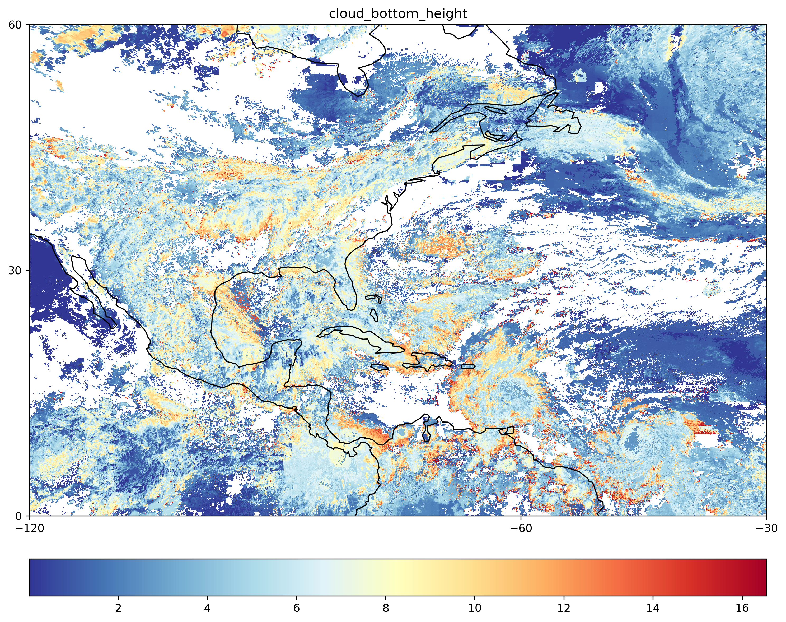
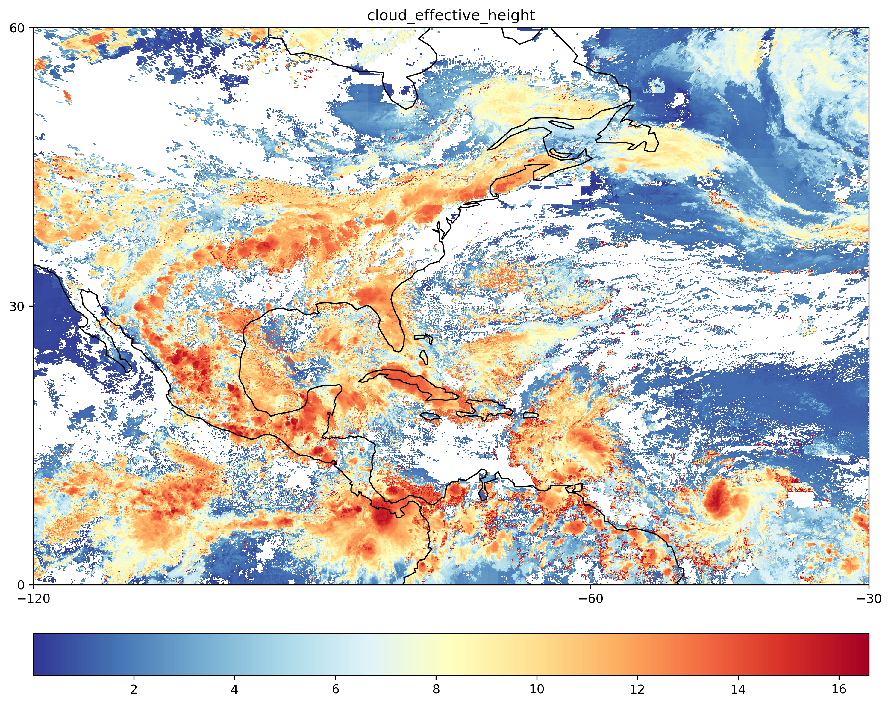
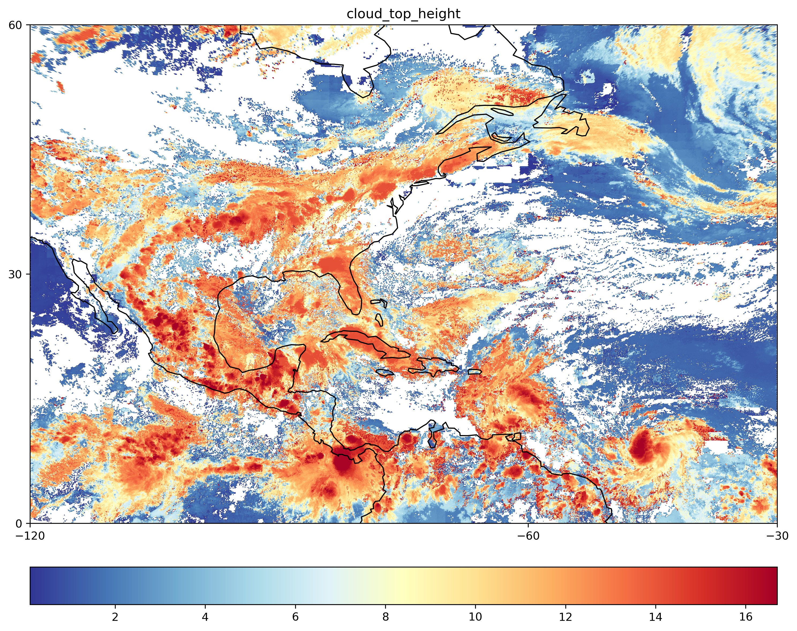
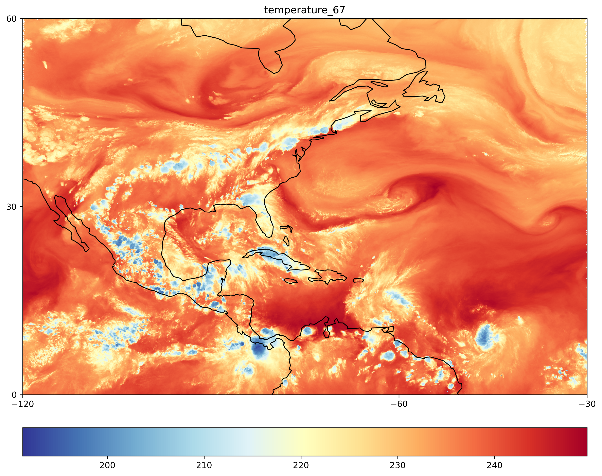
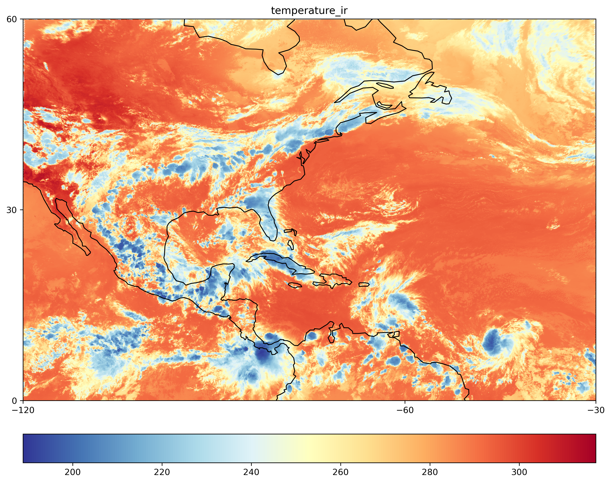
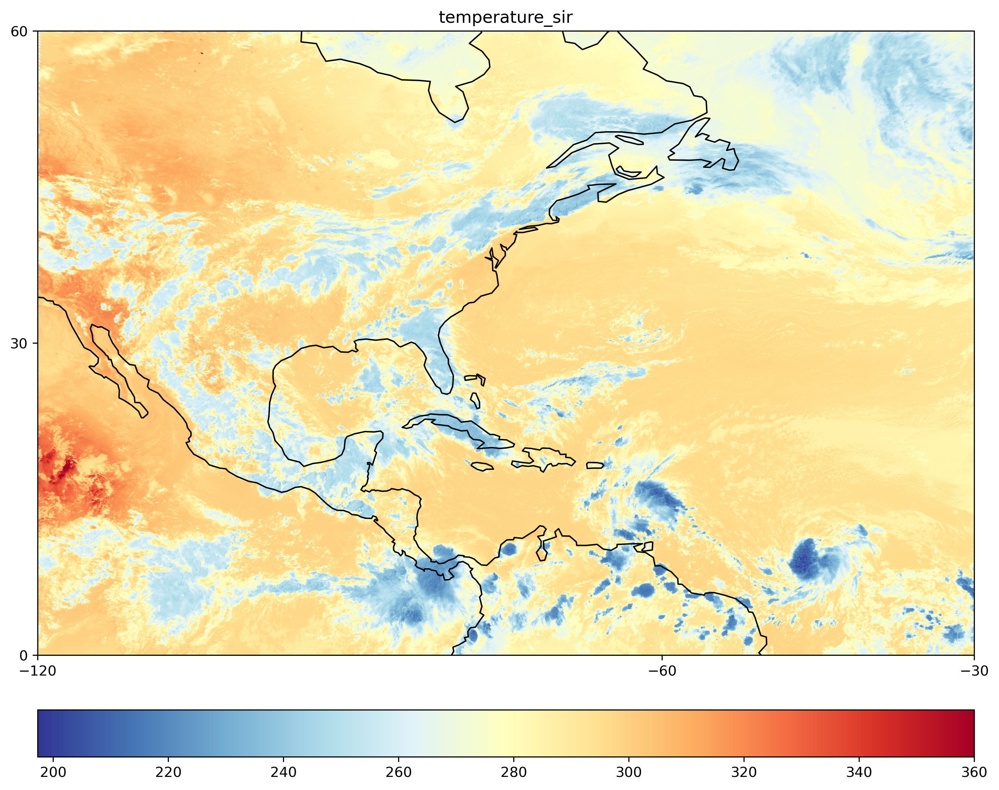
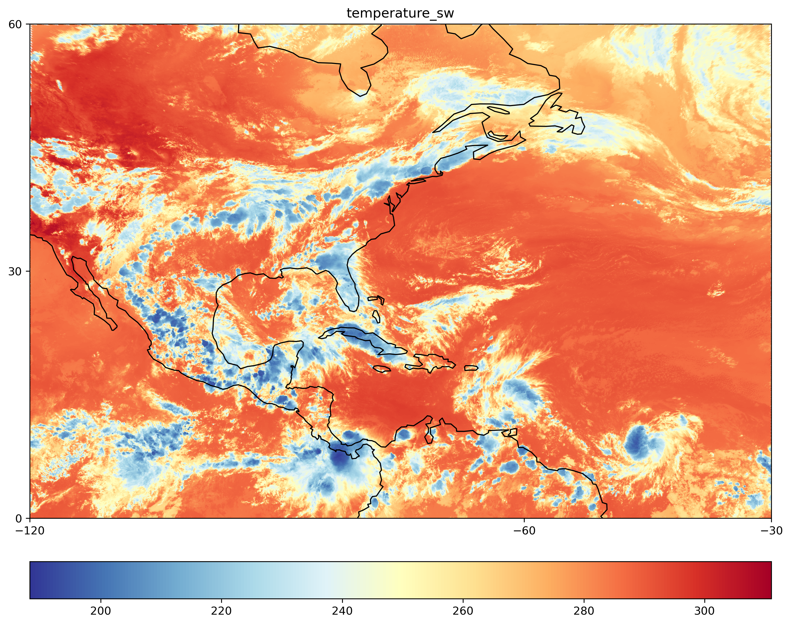
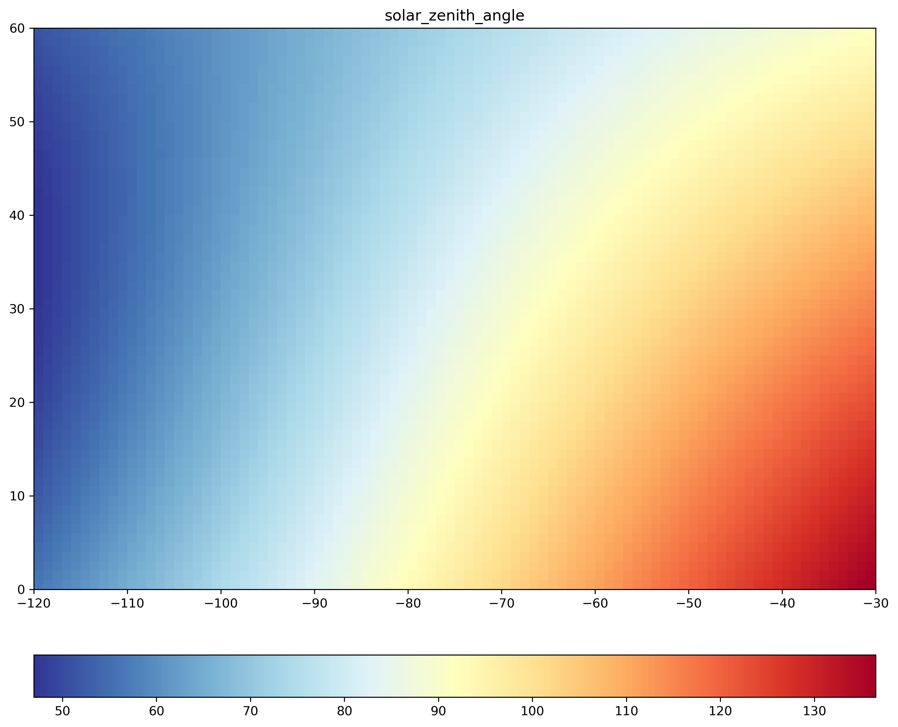

# Variables-from-GOES-16
Snapshots from different variables from GOES-16

In this file I describe the process I followed to create plots of different variables from
the GOES16 in the Northern hemisphere. The files are in NetCDF file.

## Download the information
* Go to the webpage <https://earthdata.nasa.gov/earth-observation-data/near-real-time>
* Search for GOES 16
* Click on SatCORPS CERES GEO Edition 4 GOES-16 Northern Hemisphere Version 1.2
* Download the data -> Direct download -> Navigate to the folder

The selected date was DOY 181 from 2021, for the Northern hemisphere.

## Code

The Python code to create the snapshots from the GOES 16 file is presented next.
As usual, the file type is NetCDF which can be opened using the netCDF4 library.
A list of functions with the names of the variables to be plotted is created, the
names of these variables should match with the existing variable names in the GOES-16 file.
There is a function that creates a plot for a single variable at a time. This function
is used each time in a `for loop`, in every iteration a plot is created and saved.

```Python
# -*- coding: utf-8 -*-
"""
ATMO555 Assignment E3. Plotting variables from GOES16

Created on Sun Sep 19 10:51:21 2021

@author: eduardo
"""

import matplotlib.pyplot as plt
from netCDF4 import Dataset
import cartopy.crs as ccrs


def plot_variable(lon, lat, variable, varname):
    """ A function that plots one variable at the time """

    # Create a figure
    plt.figure(figsize=(12,12))
    ax = plt.axes(projection=ccrs.PlateCarree())
    ax.coastlines()

    # Plot data
    plt.pcolor(lon, lat, variable, transform=ccrs.PlateCarree(), cmap='RdYlBu_r')
    plt.title(varname)
    plt.colorbar(orientation="horizontal", pad=0.06)#fraction=0.05)

    # Extent from metadata: ULC: 060.00 -120.00 LRC: 000.00 -030.00  RES:1.00 1.0
    ax.set_xticks([-120,-60,-30])
    ax.set_yticks([60,30,0])

    plt.savefig('snapshot_' + varname + '.png', dpi=300, bbox_inches='tight')
    plt.show()
    plt.close()


if __name__ == '__main__':

    # Path to the GOES 16 image file
    filename = 'D:/Downloads/CER_GEO_Ed4_GOE16_NH_V01.2_2021.181.2330.06K.nc'

    # Open the file using the NetCDF4 library
    nc = Dataset(filename)

    lat = nc.variables['latitude'][:]
    lon = nc.variables['longitude'][:]

    # Generate plots from a list of variables
    variables = ['temperature_sir', 'temperature_67', 'temperature_ir',
                 'temperature_sw', 'cloud_top_height', 'cloud_bottom_height',
                 'cloud_effective_height']

    for var in variables:
        print('Generating plot for {0}... please wait.'.format(var))
        # Extract the variables from the NetCDF
        data = nc.variables[var][:]
        plot_variable(lon, lat, data, var)
```

For variables like Solar Zenith Angle the code is a bit different because the extents
are the same, but the dataset size is different and does not match with the other
variable dimensions.


```Python
# -*- coding: utf-8 -*-
"""
ATMO555 Assignment E3. Plotting Solar Zenith Angle from GOES16
Created on Wed Sep 15 11:37:55 2021

@author: eduardo
"""
from osgeo import gdal
import matplotlib.pyplot as plt
import cartopy.crs as ccrs

# Open the netCDF4 file
dr = 'D:/Downloads/ATMO555/Assignment_E3/'
fn = 'CER_GEO_Ed4_GOE16_NH_V01.2_2021.181.2330.06K.nc'

# Open the file
ds = gdal.Open(dr+fn, gdal.GA_ReadOnly)

datasets = ds.GetSubDatasets()

# Print the datasets to see their names and select the one you want
for i, db in enumerate(datasets):
    print(i, db[0])

# The first dataset is 'solar_zenith_angle'
band = gdal.Open(datasets[0][0], gdal.GA_ReadOnly)

# Show metadata from the selected dataset
for key, value in band.GetMetadata().items():
    print("{:35}: {}".format(key, value))

# Get the geotransform metadata (extension) of the figure to scale the figure
geoTransform = band.GetGeoTransform()
# print(geoTransform)
minx = geoTransform[0]
maxy = geoTransform[3]
maxx = minx + geoTransform[1] * band.RasterXSize
miny = maxy + geoTransform[5] * band.RasterYSize
print("Spatial extent [minx,miny,maxx,maxy]: ", [minx, miny, maxx, maxy])

# Extract the temperature matrix data
data = band.ReadAsArray()

# Create a figure
plt.figure(figsize=(12,12))
# Extent: (left, right, bottom, top)
plt.imshow(data, extent=[minx,maxx,miny,maxy], cmap='RdYlBu_r') # This has two times: 0 or 1
plt.title('solar_zenith_angle')
plt.colorbar(orientation='horizontal', pad=0.08)
plt.savefig('snapshot_solar_zenith_angle.png', dpi=300, bbox_inches='tight')
plt.show()
plt.close()
```

Finally the snapshots are:















And for the solar zenith angle:


